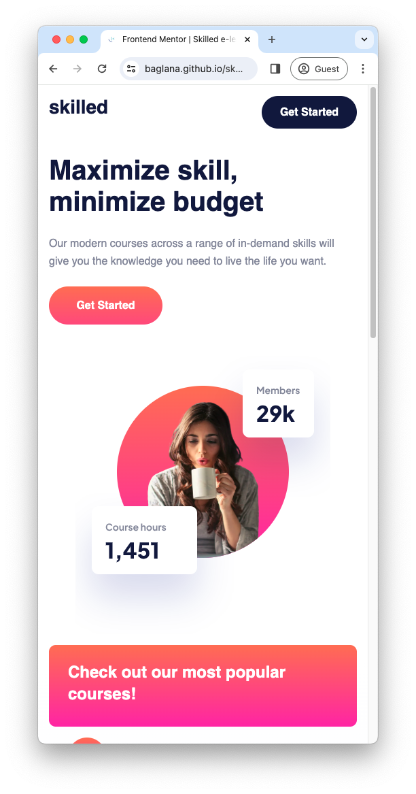
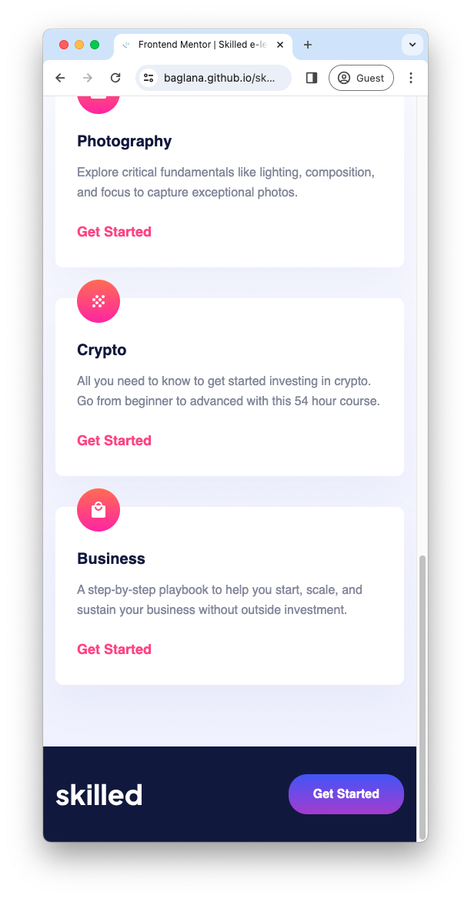
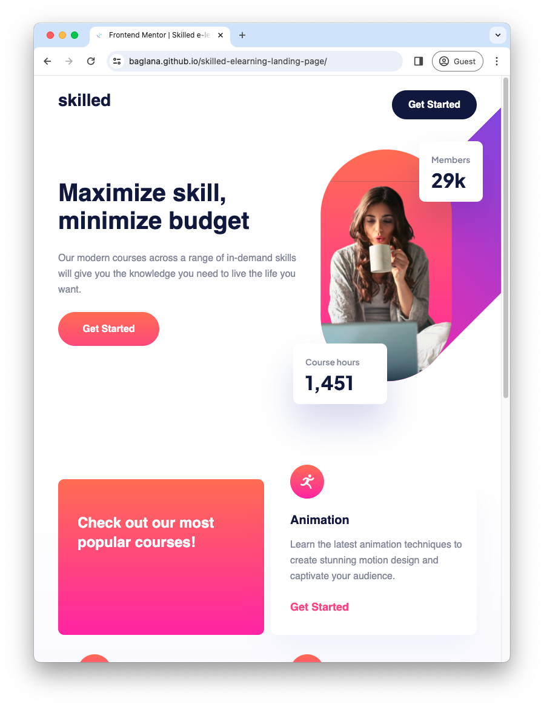
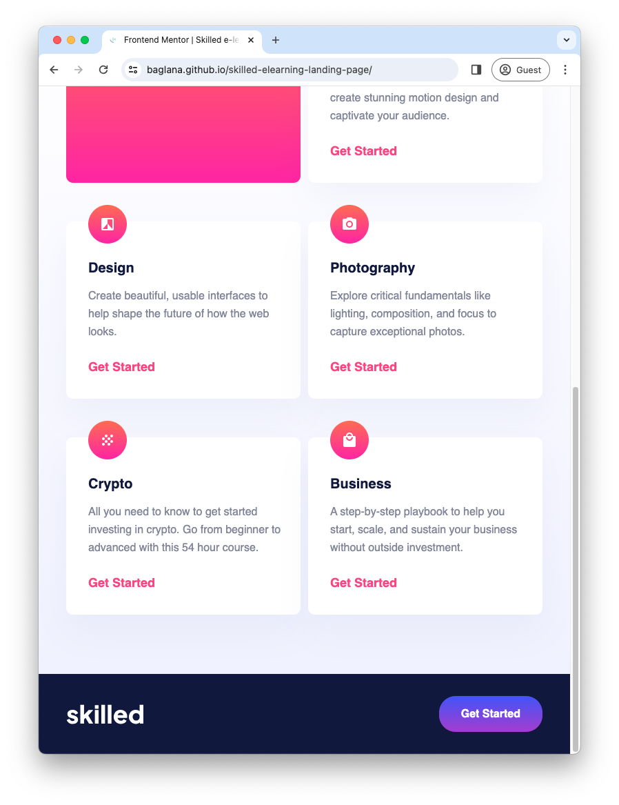
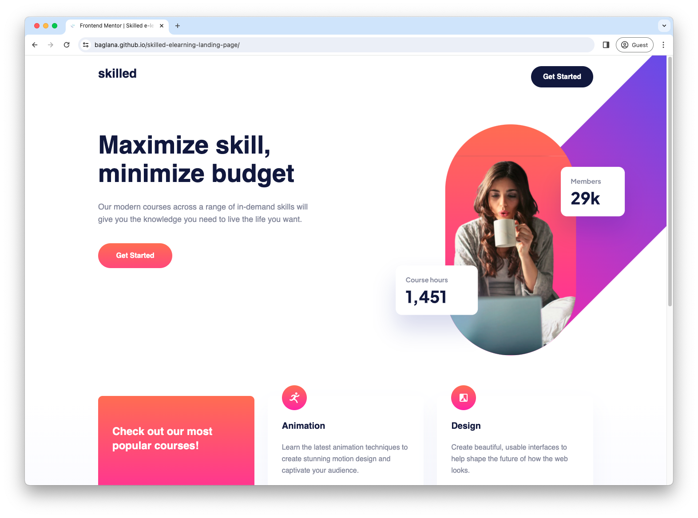
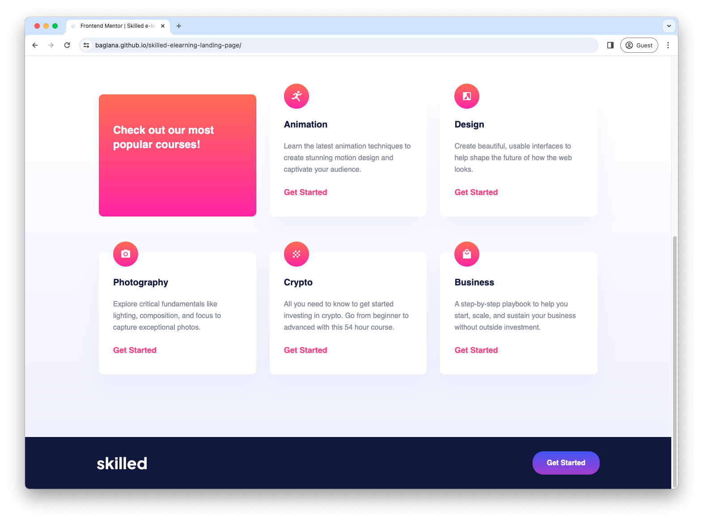

# Frontend Mentor - Skilled e-learning landing page solution

This is a solution to the [Skilled e-learning landing page challenge on Frontend Mentor](https://www.frontendmentor.io/challenges/skilled-elearning-landing-page-S1ObDrZ8q). Frontend Mentor challenges help you improve your coding skills by building realistic projects.

## Table of contents

- [Overview](#overview)
  - [The challenge](#the-challenge)
  - [Screenshot](#screenshot)
  - [Links](#links)
- [My process](#my-process)
  - [Built with](#built-with)
  - [What I learned](#what-i-learned)
  - [Continued development](#continued-development)
- [Acknowledgments](#acknowledgments)

## Overview

### The challenge

Users should be able to:

- View the optimal layout depending on their device's screen size
- See hover states for interactive elements

### Screenshot

#### Mobile



#### Tablet



#### Desktop



### Links

- Solution URL: [Add solution URL here](https://github.com/baglana/skilled-elearning-landing-page)
- Live Site URL: [Add live site URL here](https://baglana.github.io/skilled-elearning-landing-page/)

## My process

### Built with

- Semantic HTML5 markup
- Flexbox
- CSS Grid
- Mobile-first workflow
- [Tailwind](https://tailwindcss.com/) - CSS framework
- [Vite](https://vitejs.dev/) - Bundler

### What I learned

Within a team of 3, I was assigned to do the middle part with the cards.
By doing this part I practiced using Grid layout.
I also learned how to use Tailwdind utility-first CSS framework to apply styles.

```html
  <main class="bg-gradient-to-b from-color-bg to-[#f0f1ff]">
  <section class="max-w-fit m-auto px-4 md:px-10 lg:px-[10.3125rem]">
    <ul class="card-grid">
      <li class="bg-gradient-to-b from-[#ff6f48] to-[#f02aa6]">
        <h3 class="text-2xl font-extrabold text-color-text-white">
          Check out our most popular courses!
        </h3>
      </li>
      <li class="card">
        <svg ...></svg>
        <h4>Animation</h4>
        <p>
          Learn the latest animation techniques to create stunning motion
          design and captivate your audience.
        </p>
        <a href="#">Get Started</a>
      </li>
      ...
    </ul>
  </section>
</main>
```
```css
@tailwind base;
@tailwind components;
@tailwind utilities;

@layer components {
  .card-grid {
    @apply grid gap-y-10 pb-20 md:grid-cols-2 md:gap-x-[0.69rem] md:gap-y-14 md:pb-[5.38rem] lg:grid-cols-3 lg:gap-x-[1.88rem] lg:gap-y-20 lg:pb-[8.75rem];

    & > * {
      @apply pt-6 pr-[1.81rem] pb-8 pl-7 md:pt-14 md:pr-[1.31rem] md:pb-8 md:pl-8 lg:pt-16 lg:px-8 lg:pb-10 rounded-[10px];
    }
    & > .card {
      @apply grid grid-rows-[auto_1fr_auto] pt-14 shadow-[0_25px_50px_0_rgba(6,22,141,0.04)] bg-color-bg;

      & > svg {
        @apply -mt-20 w-14 h-14;
      }
      & > h4 {
        @apply text-xl/[normal] font-extrabold text-color-text-secondary;
      }
      & > p {
        @apply mt-4 lg:mt-6 text-base/[1.625rem] font-medium text-color-text-primary;
      }
      & > a {
        @apply mt-6 text-lg font-bold text-color-text-pink hover:text-color-text-hover-pink transition-all duration-150;
      }
    }
  }
}
```

### Continued development

In future projects I want to focus on dividing pages into reusable components and making transitions.

## Acknowledgments

[Singularity Frontend 2023 Team1](https://github.com/singularity-autumn-2023/team1-skilled-elearning-landing-page/graphs/contributors)
- [@RashEstebek](https://github.com/RashEstebek) - for installing Tailwind and doing `<header>`
- [@Kanskii](https://github.com/Kanskii) - for doing `<footer>`